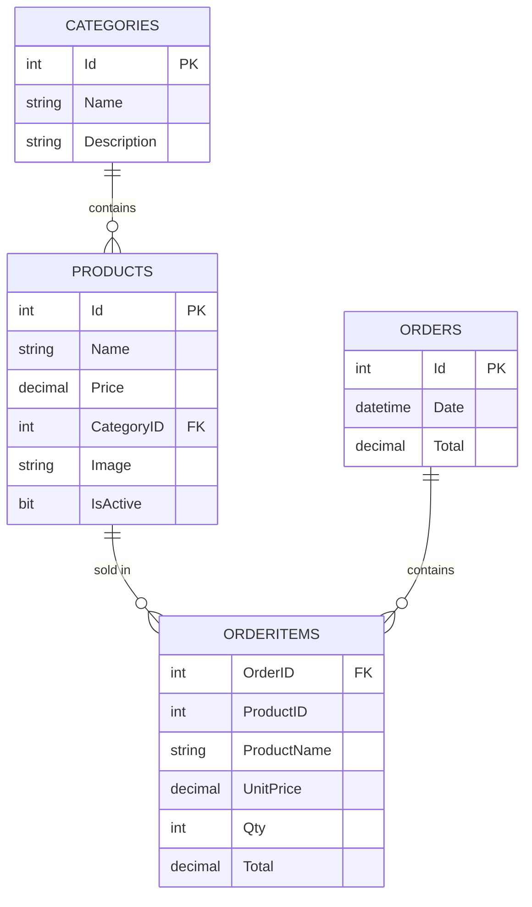
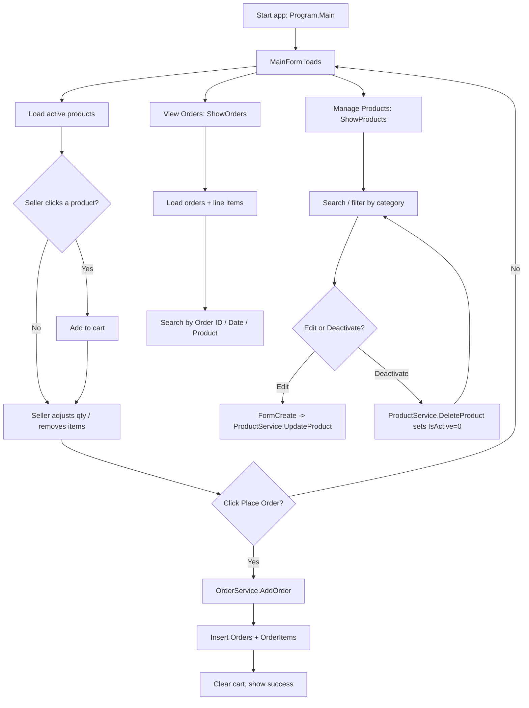
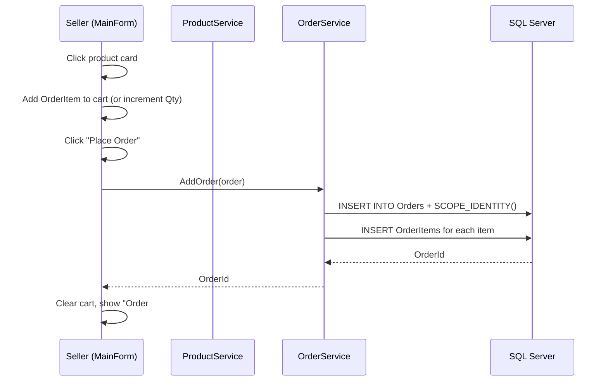
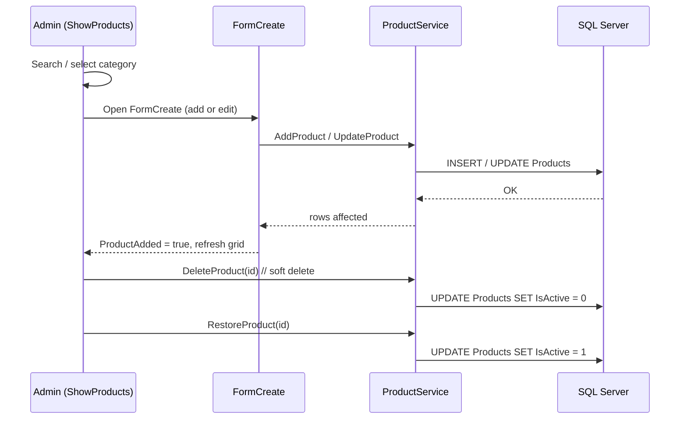
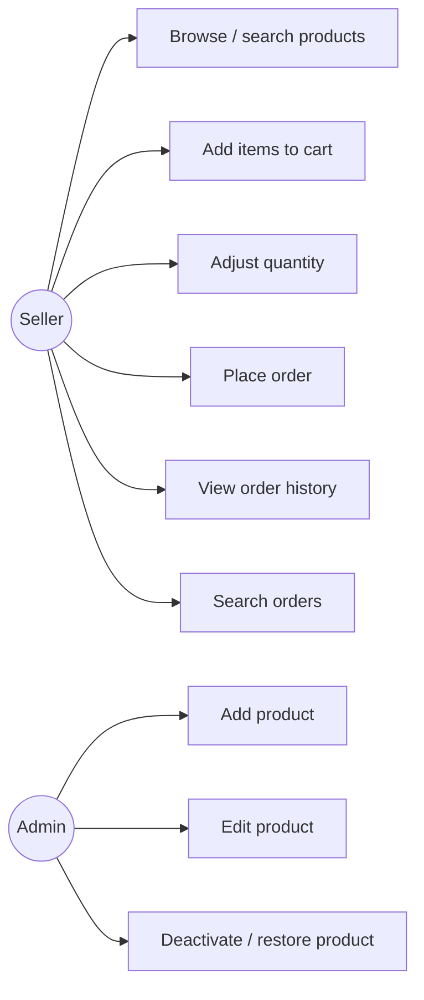
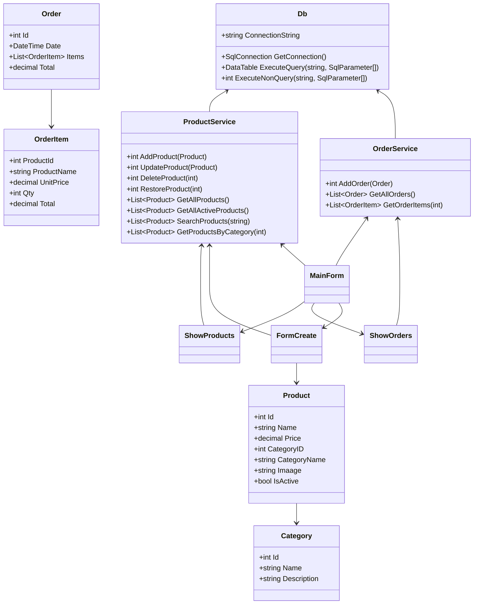

# POS System — Project Flow & UML

## 1. Project Overview

A **Windows Forms (C# / .NET 8)** Point-Of-Sale (POS) application for managing products, categories, and customer orders against an **SQL Server** database.

- **UI Framework:** Windows Forms with the **Guna.UI2** control suite (custom-styled panels, buttons, text boxes, data grids).
- **Data Access:** `Microsoft.Data.SqlClient` with a thin helper class (`Db`) that wraps `DataTable` queries and non-query commands.
- **Database:** `POS_system` on SQL Server (`DESKTOP-RCP3HG7`, Windows Authentication).
- **Language / Runtime:** C# 12 / .NET 8.0 (`net8.0-windows`).

---

## 2. Project Structure

```
C#_POS_System/
├── Program.cs                  // Entry point, starts MainForm
├── DbConnection/
│   └── Db.cs                   // Connection string + ExecuteQuery / ExecuteNonQuery helpers
├── Models/
│   ├── Category.cs             // Id, Name, Description
│   ├── Product.cs              // Id, Name, Price, CategoryID, CategoryName, Image, IsActive
│   ├── Order.cs                // Id, Date, Total, Items[]
│   └── OrderItem.cs            // ProductId, ProductName, UnitPrice, Qty, Total (computed)
├── Services/
│   ├── ProductService.cs       // Add / Update / Delete(soft) / Restore / query products
│   └── OrderService.cs         // AddOrder, GetAllOrders, GetOrderItems
└── Forms/
    ├── MainForm.cs             // Selling screen: product grid + cart + checkout
    ├── ShowProducts.cs         // Product management: search, filter, edit, deactivate/restore
    ├── ShowOrders.cs           // Order history: grid with line items, search + filter
    ├── FormCreate.cs           // Add / edit product dialog (name, price, category, image)
    └── *.Designer.cs           // UI layout (auto-generated)
```

---

## 3. Database Schema

| Table | Columns |
|-------|---------|
| `Categories` | `Id` (PK), `Name`, `Description` |
| `Products` | `Id` (PK), `Name`, `Price`, `CategoryID` (FK → Categories.Id), `Image`, `IsActive` (bit) |
| `Orders` | `Id` (PK), `Date`, `Total` |
| `OrderItems` | `OrderID` (FK → Orders.Id), `ProductID`, `ProductName`, `UnitPrice`, `Qty`, `Total` |

### ER Diagram



---

## 4. System Flow

### 4.1 High-Level Flowchart



### 4.2 Typical Ordering Flow



### 4.3 Product Management Flow



---

## 5. Use Case Diagram



---

## 6. Class Diagram



---

## 7. Feature Notes

1. **Soft delete (IsActive):** Deleting a product sets `IsActive = 0` instead of removing the row, so `OrderItems` history is preserved and no foreign-key errors occur. Inactive products are hidden from the selling screen and shown greyed-out in the management screen with a **Restore** option.
2. **Search / filter:**
   - Products: by name (text) and by category (combo).
   - Orders: by `Order ID`, `Date`, or `Product Name` (combo selects the field).
3. **Order totals** are computed as `UnitPrice * Qty` per line, summed in the cart, and stored on the `Orders.Total` column at checkout.